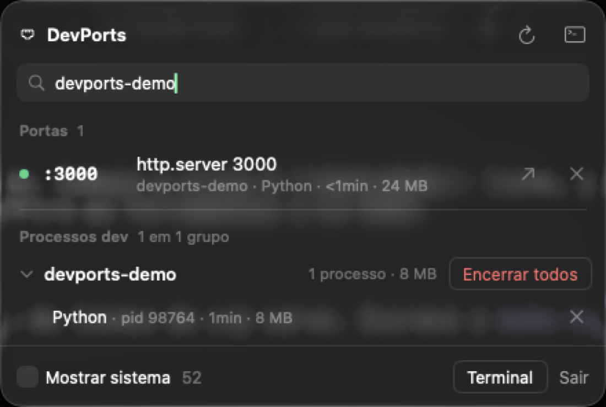
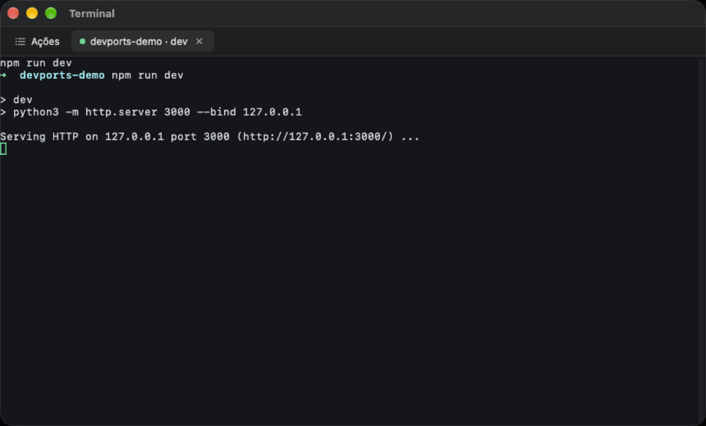

# DevPorts

App de barra de menus do macOS que mostra quais portas estão ocupadas e de qual projeto é cada processo dev (`node`, `python`, `java`, bancos de dados). Também encerra processos e traz um terminal integrado.

<p>
  
  
</p>

- **Portas:** cada porta em uso, com o projeto, o executável, o uptime e a RAM. O selo REDE marca porta exposta fora do loopback.
- **Processos dev:** os processos sem porta, agrupados por projeto e ordenados por RAM.
- **Busca:** por porta, pid, processo ou projeto. Uma porta sem ninguém nela aparece como "Porta N livre".
- **Encerrar:** ✕ na linha, "Forçar" se o processo não sair em 5 s, e "Encerrar todos" no grupo.
- **Terminal:** shell na pasta do projeto, scripts do `package.json`, "Reiniciar com log" e a aba Ações com o histórico.

O plano está em [PRD.md](PRD.md) e a identidade visual em [DESIGN.md](DESIGN.md).

## Requisitos
- macOS 14 ou superior
- Xcode 26 ou superior (Swift 6.2)
- `brew install xcodegen`
- `xcodebuild -downloadComponent MetalToolchain` (o terminal integrado, SwiftTerm, compila shaders Metal)

## Build

```sh
xcodegen
xcodebuild -scheme DevPorts -configuration Release -derivedDataPath build -skipPackagePluginValidation
cp -R build/Build/Products/Release/DevPorts.app ~/Applications/
open ~/Applications/DevPorts.app
```

Para abrir junto com o login: Ajustes do Sistema › Geral › Itens de Início › `+` › DevPorts.

"Reiniciar com log" relança o comando num shell de login, com o ambiente do seu `.zshrc`, não com o ambiente original do processo. Uma variável exportada só no terminal onde o servidor foi iniciado não é repassada.

## Desenvolvimento

```sh
brew install lefthook gitleaks
lefthook install
```

- **pre-commit:** gitleaks e `swift format lint --strict` nos arquivos em stage.
- **CI no PR:** lint e testes no runner `macos-26`.
- **Ícone e glifo:** depois de editar os SVGs em `design/`, rode `design/make-icons.sh` (precisa de `brew install librsvg`).

## Licença

[MIT](LICENSE)
